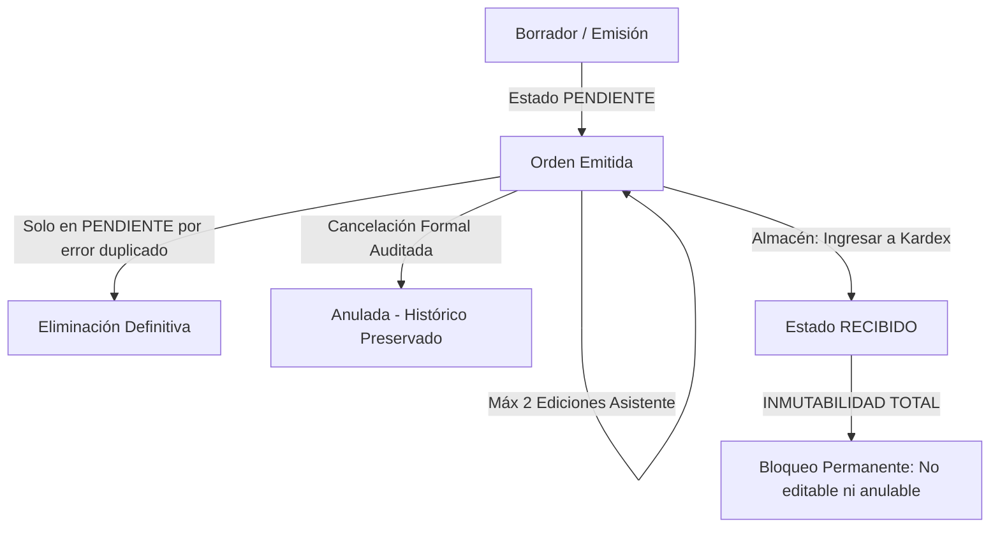

# MANUAL DE OPERACIÓN ESTÁNDAR Y POLÍTICAS DE CUMPLIMIENTO CORPORATIVO
## ERP INDUSTRIAL QUIMICORP PERÚ S.A.C.
**Dirigido a:** Área de Asistencia Administrativa, Producción, Almacén y Control de Calidad  
**Aprobado por:** Gerencia General & Dirección de Operaciones  
**Versión de Documento:** 2.4 — Edición Operativa de Usuario  
**Carácter:** Normativo, Obligatorio y de Cumplimiento Contractual  

---

## 1. INTRODUCCIÓN Y MARCO DE CUMPLIMIENTO CORPORATIVO

El presente manual establece las normas operativas, principios de integridad de datos y directivas de control interno que rigen el uso del software empresarial de **QUIMICORP PERÚ S.A.C.**

El ERP de Quimicorp no es un procesador de textos ni una hoja de cálculo abierta donde se escribe libremente sin consecuencias; es un **sistema industrial metrológico y contable en tiempo real**. Cada información ingresada alimenta de forma inmediata los costos de fabricación, los balances de stock en almacén, las compras a distribuidores y las declaraciones tributarias ante SUNAT.

Por lo tanto, la exactitud en el llenado de información es una **responsabilidad laboral directa** de cada usuario con acceso al sistema.

---

## 2. ARQUITECTURA DE DATOS PARA EL USUARIO: EL POR QUÉ DE LOS IDENTIFICADORES (ID) Y LA ORTOGRAFÍA

Una de las quejas o confusiones más recurrentes en el área operativa es: *"El sistema no reconoce mi fórmula"* o *"El sistema no encuentra el químico que quiero cotizar"*. A continuación se explica con total claridad la causa raíz de este fenómeno.

### 2.1. ¿Por qué todo insumo, cliente y fórmula debe tener un ID Legítimo?

En el mundo físico, los seres humanos nos identificamos de forma legal e inequívoca mediante un número de DNI. Dos personas pueden llamarse "Carlos Mendoza", pero ante el Estado, sus DNIs son únicos y jamás se confunden.

En el ERP de Quimicorp ocurre exactamente lo mismo:
1. **Identidad Digital Única (ID):** Cada materia prima (ej. *Texapon 70%*, *Soda Cáustica*, *Fragancia Tutti Frutti*) tiene asignado en la base de datos un **código digital único (ID)**.
2. **Relación Inquebrantable:** Cuando Producción formula un lote o Administración emite una Orden de Compra, el sistema no enlaza palabras sueltas; **enlaza el ID legítimo del catálogo**.
3. **Cálculo de Costos y Stock:** Gracias a ese ID, el sistema sabe exactamente cuántos kilos quedan en el tanque, cuánto costó el gramo al comprarlo y cómo descontarlo en el Kardex al fabricar.

### 2.2. La Discordancia Léxica: Nombre Químico Oficial vs. Jergas o Apodos

El software **rechaza categóricamente o no encuentra los registros** cuando el operador comete **errores ortográficos o utiliza jergas coloquiales**.

#### Ejemplos de Discordancia Provocada por el Usuario:

| Lo que está registrado formalmente en el Catálogo | Lo que el operador intenta escribir en el sistema | Resultado en el ERP | Consecuencia en Planta |
| :--- | :--- | :--- | :--- |
| **SODA CÁUSTICA ESCAMAS 99%** | *"soda"*, *"la cáustica"*, *"sosa"* | ❌ **No encontrado** | No se puede cotizar ni formular. El usuario cree falsamente que el sistema falló. |
| **FRAGANCIA TUTTI FRUTTI** | *"tuti fruti"*, *"tutifrutti"*, *"fruta dulce"* | ❌ **No encontrado** | Descuadre de inventario y bloqueo de la orden. |
| **TEXAPON N70 (LAURIL ÉTER SULFATO)** | *"jabon liquido base"*, *"texapon 70"*, *"el espumante"* | ❌ **No encontrado** | Alerta en el reactor: insumo inexistente. |
| **ÁCIDO SULFÓNICO LINEAL 90%** | *"sulfonico"*, *"acido sulf"* | ❌ **No encontrado** | Error en hoja de pesaje y QA. |

> [!CAUTION]
> **El sistema NO lee el pensamiento del usuario.** Si el catálogo maestro tiene registrado el insumo con su nombre oficial y el operador escribe un apodo o comete faltas de ortografía (omisión de letras, errores tipográficos o nombres callejeros), el motor de búsqueda no encontrará el ID correspondiente. Esto no es un error informático; es una **negligencia en la entrada de datos**.

### 2.3. La Regla de Oro: "Registro Único en Catálogo" y Selección Asistida

Para evitar duplicidades, caos contable y compras fantasmas:
1. **Registro por Única Vez:** Cada insumo químico se crea una sola vez en el catálogo corporativo con su denominación comercial estándar y especificación de pureza.
2. **Uso Obligatorio del Buscador Inteligente:** Los formularios de Órdenes de Compra, Cotizaciones y Fórmulas cuentan con **desplegables inteligentes**. El usuario debe escribir las primeras letras del nombre oficial y **hacer clic en el insumo listado**, asegurando así que se capture su ID legítimo.
3. **Prohibición de Inventar Textos Libres:** Si un insumo no aparece en el buscador, no se debe forzar una escritura libre con apodos. El procedimiento correcto es solicitar al Administrador o a Gerencia el alta oficial del insumo en el catálogo maestro.

---

## 3. SISTEMA DE MONITOREO EN TIEMPO REAL: CERO EXCUSAS DE "EL SISTEMA NO FUNCIONA"

Es común en ambientes de oficina y planta que, ante un error propio de digitación o una distracción, se recurra a la afirmación: *"El sistema está fallando, no me deja guardar"*. En Quimicorp, esta excusa carece de validez gracias a nuestra infraestructura de monitoreo empresarial.

### 3.1. Telemetría 24/7 y Monitoreo Activo (Sentry & Logs Inmutables)

El ERP Quimicorp cuenta con un sistema de auditoría telemétrica avanzada (**Sentry Enterprise** y registro transaccional en PostgreSQL):

1. **Grabación de Eventos en Milisegundos:** Cada clic, cada tecla pulsada, cada intento de envío de formulario y cada respuesta del servidor queda registrada con:
   * **Nombre y correo del usuario** autenticado.
   * **Dirección IP** y dispositivo desde donde se conectó.
   * **Fecha, hora exacta, minutos y segundos**.
   * **Datos exactos que el usuario escribió** en cada casilla antes de presionar el botón.
2. **Detección Inmediata de Negligencia:** Cuando un usuario afirma que *"el sistema no funcionó"*, el equipo de Sistemas y Gerencia revisa la telemetría en segundos. El registro revela con precisión matemática:
   * *"El usuario ingresó cantidad '1' con unidad 'GR' a un precio de S/ 95.00 para 1 Kilo de fragancia."*
   * *"El usuario intentó guardar un proveedor dejando el campo RUC vacío."*
   * *"El usuario intentó registrar una fórmula escribiendo un nombre no catalogado."*

### 3.2. La Diferencia entre una "Falla de Sistema" y una "Validación de Seguridad"

* **Una Falla de Sistema (Bug / Caída):** Ocurre cuando el servidor se desconecta y la pantalla muestra un error crítico `500 Server Error`. Esto genera una alarma técnica inmediata que Sistemas atiende en minutos.
* **Una Validación de Seguridad (Rechazo Correcto):** Ocurre cuando el sistema muestra un mensaje de alerta en amarillo o rojo (por ejemplo: *"Has alcanzado el límite de 2 ediciones permitidas"*, *"La cantidad debe ser mayor a cero"*, *"Unidad en Gramos pero precio de Kilo"*).
  * En este caso, **el sistema funcionó de manera PERFECTA**, porque impidió que el descuido de un colaborador destruyera la contabilidad de la empresa o generara pérdidas económicas en almacén.

---

## 4. POLÍTICAS DE SEGURIDAD Y PREVENCIÓN DE FRAUDE (NIVEL CONTRACTUAL)

Por qué los roles de **Asistente Administrativo** y **Operario de Producción** tienen accesos estrictamente delimitados y **prohibición total de manipular valores financieros o realizar eliminaciones masivas**.

### 4.1. El Principio de Segregación de Funciones (Segregation of Duties - SoD)

En auditoría corporativa y normatividad tributaria internacional, ninguna persona que elabore o digite una orden debe tener la facultad de aprobar pagos, alterar precios base o modificar cuentas bancarias libremente. Permitir esto abre la puerta a:
1. **Fraudes por Alteración de Precios:** Un asistente podría pactar con un proveedor corrupto ingresar insumos a precios inflados o registrar facturas por insumos que nunca llegaron.
2. **Desvío de Fondos:** Modificar el número de cuenta bancaria o RUC de un proveedor justo antes de la transferencia.
3. **Destrucción de Evidencia:** Eliminar u ocultar órdenes de compra o fórmulas erróneas para que Gerencia no detecte pérdidas operativas.

### 4.2. El Límite Estricto de 2 Ediciones para Asistentes en Órdenes de Compra

El sistema aplica de manera inquebrantable la siguiente regla de negocio:

* **Asistente Administrativo / Operario:** Puede editar una orden de compra pendiente un **MÁXIMO DE 2 VECES**.
  * *1ra Edición:* Para corregir un error menor de tipeo o ajustar la fecha estimada de entrega.
  * *2da Edición:* Oportunidad final de subsanación.
  * *3er Intento:* **BLOQUEO AUTOMÁTICO.** El sistema rechaza la edición con el mensaje de error:
    > *"Has alcanzado el límite máximo de 2 ediciones permitidas para tu rol en la orden OC-XXXX-XXXXXX. Para correcciones adicionales, solicita autorización a Gerencia o Administración."*
* **Gerencia General / Dirección:** Cuenta con **ediciones ilimitadas** para auditar, autorizar y rectificar cualquier operación que requiera revisión superior y trazabilidad excepcional.

> [!IMPORTANT]
> **Protección Legal para el Colaborador:** Estas restricciones no son solo para proteger el patrimonio de Quimicorp; **protegen al propio trabajador**. Al estar limitado por sistema, el asistente queda legalmente exento de sospechas de colusión, manipulación contable o fraude ante revisiones de auditoría interna o fiscalizaciones de SUNAT.

---

### 4.3. Tipología de Infracciones de Seguridad, Fraude y Daño Patrimonial Monetario

En el ERP de Quimicorp se han implementado blindajes técnicos para neutralizar conductas que vulneran la ley, ponen en riesgo la liquidez de la empresa o constituyen delitos económicos. Toda manipulación indebida en estos módulos está tipificada como **falta laboral grave con consecuencias penales inmediatas**:

#### 4.3.1. Alteración de Cuentas Bancarias y Códigos Interbancarios (CCI) de Proveedores
* **El Riesgo de Fraude:** Modificar los datos bancarios de un proveedor en el catálogo o en la Orden de Compra justo antes de un pago programado para desviar fondos de Quimicorp hacia cuentas de terceros o personales.
* **Política de Seguridad:** Los números de cuenta y CCI de los proveedores están sujetos a verificación de titularidad con RUC ante la entidad bancaria. Cualquier intento de sustituir un número de cuenta sin la carta de certificación bancaria oficial firmada por el representante legal del proveedor será derivado de inmediato a auditoría y Gerencia General.

#### 4.3.2. Manipulación no Autorizada de Líneas de Crédito y Días de Pago (`limiteCredito` / `diasCreditoMax`)
* **El Riesgo Financiero:** Elevar de manera arbitraria la línea de crédito o ampliar los días máximos de cobranza a clientes morosos, familiares o empresas amigas sin el aval formal de Gerencia.
* **Consecuencia:** Esto genera cuentas incobrables directas, desabastecimiento de caja chica y quiebra del ciclo de liquidez empresarial.
* **Blindaje:** El módulo de Clientes y Cuentas por Cobrar bloquea la emisión de nuevos pedidos y entregas de mercadería cuando un cliente supera su límite de crédito o presenta facturas vencidas con saldo pendiente. Ningún asistente tiene atribución para levantar este bloqueo.

#### 4.3.3. Alteración de Precios de Venta y Aplicación de Descuentos Arbitrarios
* **El Riesgo Comercial:** Modificar a la baja los precios unitarios de productos terminados o aplicar descuentos discrecionales en cotizaciones para favorecer a ciertos compradores o recibir comisiones indebidas por debajo de la mesa.
* **Regla Inquebrantable:** Los precios oficiales están calculados sobre la base de costos de materia prima, mano de obra y margen neto corporativo. Todo descuento especial requiere la aprobación digital explícita de Gerencia General.

#### 4.3.4. Fuga de Activos por Omisión de Adicionales y Envases (Baldes, Cilindros, Fletes)
* **El Riesgo de Pérdida Física:** Vender producto envasado cobrando únicamente el líquido a granel y regalando u omitiendo en el sistema el valor del envase (baldes de 20 L, bidones, cilindros de 55 galones o herramientas de aplicación).
* **Consecuencia en Kardex:** Cada envase tiene un costo de adquisición monetario. Si el personal de ventas o asistencia entrega envases sin incluirlos en el pedido o los cobra "en efectivo por fuera", se produce un faltante físico en almacén y una sustracción indebida de patrimonio.

#### 4.3.5. Intento de Escalamiento Ilícito de Roles y Permisos en el Módulo de Asistencia
* **Por qué el CRUD de Roles está Blindado Exclusivamente a Gerencia General:** En el módulo de Asistencia del Personal, la reasignación de cargos y roles (`OPERARIO`, `SUPERVISOR`, `ASISTENTE`, `ADMINISTRACION`) está protegida tanto en el código del servidor (`@Roles(Role.GERENCIA)`) como en la interfaz gráfica.
* **El Peligro de Seguridad:** Si un asistente o supervisor pudiera cambiarse el rol a sí mismo o a sus compañeros, podría autoasignarse privilegios de Administrador para borrarse faltas o tardanzas, autorizarse compras fraudulentas, desbloquearse límites de edición o eliminar registros contables. El intento de manipular este sistema o vulnerar credenciales ajenas es causal de despido fulminante.

#### 4.3.6. Distorsión Metrológica Negligente o Maliciosa (El Fraude por Inflación de Inventario)
* **El Caso Real (Kilos vs. Gramos):** Si un asistente registra en una Orden de Compra `1 GR` a un precio de `S/ 95.00` cuando en realidad compraba `1 KG`:
  * El sistema asume que la unidad básica vale S/ 95.00 por gramo.
  * Por regla matemática de conversión, el valor registrado para 1 Kilo pasa a ser de **S/ 95,000.00**.
  * Si la orden llega a entrar a Kardex, el activo corriente de la empresa se infla artificialmente en millones de soles ficticios, viciando los estados financieros y exponiendo a la empresa a graves multas tributarias por parte de SUNAT por inconsistencia en la valuación de inventarios.

---

## 5. GUÍA PRÁCTICA PASO A PASO: ÁREA DE ASISTENCIA ADMINISTRATIVA

### 5.1. Emisión de Órdenes de Compra (Módulo: `/administracion/ordenes`)

1. **Paso 1: Búsqueda del Proveedor:**
   * Utilizar el buscador de proveedores escribiendo la Razón Social o el RUC de 11 dígitos.
   * Seleccionar el proveedor de la lista desplegable. Esto carga de inmediato su condición de pago oficial y su RUC homologado.
2. **Paso 2: Selección de Insumos (Materia Prima):**
   * Escribir el nombre oficial en el buscador de insumos.
   * Seleccionar el insumo listado. **Queda terminantemente prohibido inventar nombres abreviados, jergas o apodos.**
3. **Paso 3: Alerta Metrológica Crítica (KILOGRAMOS vs. GRAMOS / LITROS vs. MILILITROS):**
   * **CUIDADO EXTREMO:** El sistema alertará visualmente en color ámbar si seleccionas `GR` (Gramos) y colocas una cantidad baja con un costo elevado (precio típico de Kilo).
   * *Verificación Obligatoria:* Si compraste un saco o galón cerrado de 20 Kilos, la unidad DEBE ser `KG` y la cantidad `20`. Si se compran aditivos de alta pureza dosificados en gramos, verificar que el precio unitario corresponda al costo real de UN solo gramo (ej. S/ 0.095 por gramo, no S/ 95.00).
4. **Paso 4: Verificación del Total Estimado:**
   * Revisar el cuadro verde del Total Estimado de la Orden antes de presionar *"Emitir Orden de Compra"*.
   * Si el monto total en pantalla no coincide al centavo con la cotización formal o factura proforma del proveedor, **no emitas la orden**. Revisa la cantidad y el precio unitario ingresado.

### 5.2. Corrección y Ciclo de Vida de las Órdenes de Compra

Toda Orden de Compra en Quimicorp transita por estados estrictos que garantizan el control tributario y operativo:

#### Reglas de Gestión en Órdenes de Compra:

1. **Edición de Órdenes Pendientes:**
   * Mientras la orden esté en estado `PENDIENTE`, el asistente puede pulsar **"Editar OC"** para subsanar errores de digitación o ajustar fechas de entrega.
   * El sistema muestra en todo momento el contador visible (`Edición 1 de 2`).
   * Al alcanzar las 2 ediciones, el asistente no podrá volver a modificarla.
2. **Protocolo ante Agotamiento de Ediciones:**
   * Si se agotan las 2 ediciones y persiste un error, el asistente **no debe inventar una orden nueva ni culpar al software**.
   * Debe remitir una solicitud por correo o comunicación interna a Gerencia General o Administración Superior explicando el motivo de la tercera corrección para que el Administrador proceda con la edición autorizada.
3. **Inmutabilidad Absoluta al Ingresar a Kardex (Estado `RECIBIDO`):**
   * Cuando el área de Almacén pulsa el botón **"Ingresar a Kardex"**, la materia prima ingresa físicamente al stock de fábrica y a la valorización contable.
   * En ese instante, la orden pasa a estado `RECIBIDO` y **QUEDA TOTALMENTE BLOQUEADA**.
   * **Ni el Asistente, ni el Administrador, ni el Programador pueden editarla ni eliminarla**, porque cualquier cambio retroactivo alteraría el costo promedio ponderado de producción y falsearía los libros contables presentados a SUNAT.
4. **Diferencia Operativa y Legal: "Eliminar OC" vs. "Anular OC":**
   * **Eliminación Definitiva (`DELETE`):**
     * *Cuándo procede:* Únicamente cuando la orden está en estado `PENDIENTE` y se generó por un error involuntario de doble clic o duplicidad inmediata que aún no ha tenido contacto con el proveedor ni con almacén.
     * *Efecto:* Borra el registro antes de que entre a cualquier circuito contable.
   * **Anulación Formal (`PATCH /anular`):**
     * *Cuándo procede:* Cuando la orden ya fue enviada o comunicada, pero el proveedor no tiene stock, canceló el pedido o se renegoció la compra.
     * *Efecto:* La orden se marca como `ANULADA`. **El código correlativo se conserva en el historial para auditoría fiscal**, dejando constancia transparente de por qué no se completó la operación.
     * *Regla Estricta:* Una orden que ya fue ingresada a Kardex (`RECIBIDO`) **jamás puede anularse**, y una orden anulada **jamás puede recepcionarse**.

---

## 6. GUÍA PRÁCTICA PASO A PASO: ÁREA DE PRODUCCIÓN & ALMACÉN

### 6.1. Sistema Maestro de Fórmulas y Variantes de Clientes

1. **Inmutabilidad de la Receta Industrial:**
   * Las fórmulas maestras son propiedad intelectual y técnica de Quimicorp. Los porcentajes de materias primas deben sumar con exactitud matemática el **100.00%** o el peso exacto del Batch en Kilogramos.
   * Los operadores de reactor no deben alterar los componentes de una fórmula sin la orden de producción formalmente emitida y aprobada por QA.
2. **Dosificación y Balanzas en Planta:**
   * El pesaje en planta opera con una precisión de hasta 4 decimales ($0.0001\text{ kg}$).
   * Cualquier ajuste fino (adición extra de fragancia, colorante, espesante o neutralizante para corregir pH o viscosidad) debe ser registrado en el módulo de **Ajuste Fino**, asociando el insumo con su ID de catálogo para que el Kardex descuente la merma correspondiente.

### 6.2. Recepción de Mercadería y Control de Stock

1. **Cotejo Físico vs. Digital:**
   * Al recibir la materia prima en puerta de fábrica, el encargado de almacén debe contrastar la Guía de Remisión física del transportista contra la Orden de Compra en pantalla.
   * Si la orden dice `100 KG` pero el proveedor trajo `90 KG`, **no se debe recibir la orden completa**. Se debe coordinar con Administración para emitir la corrección antes de alimentar el Kardex.
2. **Ingreso a Kardex:**
   * Al pulsar *"Ingresar a Kardex"*, el insumo se convierte automáticamente en stock disponible para fabricación en los tanques y reactores.

### 6.3. Asistencia Biométrica y Asignación de Roles

1. **Marcación con Huella Digital:**
   * Las marcaciones en el dispositivo ZKTeco son transmitidas al instante mediante un servicio automatizado.
   * Cada trabajador debe marcar: Ingreso, Salida a Refrigerio, Retorno de Refrigerio y Salida Final.
   * El sistema calcula de forma estricta los minutos de tardanza en base a la tolerancia reglamentaria de 15 minutos de su turno.
2. **Asignación Exclusiva de Roles por Gerencia General:**
   * Ningún jefe de planta ni asistente administrativo tiene privilegios para modificar su propio cargo, su turno ni sus roles en el sistema.
   * Únicamente la **Gerencia General** cuenta con los botones de acción para asignar si un colaborador es `OPERARIO`, `SUPERVISOR DE PLANTA` o reasignar sus facultades en el ERP.

---

## 7. DECÁLOGO DE BUENAS PRÁCTICAS Y RESOLUCIÓN DE INCIDENCIAS

### 7.1. Matriz de Auditoría: Lo que el Usuario dice vs. Lo que Registra el Sistema

| Lo que el colaborador manifiesta | Lo que realmente ocurrió y registra Sentry / Base de Datos | Solución Operativa Inmediata |
| :--- | :--- | :--- |
| *"El sistema no me deja guardar la orden de compra."* | El usuario dejó el campo de precio unitario en blanco o ingresó texto en una casilla numérica. | Colocar números válidos mayores a cero y verificar que no existan campos obligatorios vacíos. |
| *"El sistema borró mi fórmula o no la reconoce."* | El usuario escribió el nombre con faltas ortográficas o inventó una sigla que no existe en el catálogo. | Buscar el insumo en el selector escribiendo sus primeras 3 letras y haciendo clic en el resultado del catálogo. |
| *"El botón de guardar se bloqueó y ya no puedo editar."* | El colaborador ya utilizó sus **2 oportunidades de edición permitidas** para su rol. | Solicitar formalmente a Gerencia General o Administración Superior la revisión y modificación autorizada. |
| *"El sistema no me deja borrar ni cambiar una orden ya recibida."* | La orden ya fue ingresada a Kardex (estado `RECIBIDO`) y el inventario real ya fue cargado. | **Por ley tributaria y control interno, las órdenes recibidas son inmutables.** No insista; no es un fallo, es protección contable. |
| *"Se descuadró el costo del lote en miles de soles."* | El operador colocó unidad `GR` (Gramos) en vez de `KG` (Kilos) al comprar el insumo a granel. | Revisar siempre la unidad de medida antes de emitir cualquier documento. Si cuesta S/ 90 el kilo, la unidad DEBE ser `KG`. |
| *"La huella no marcó mi hora de ingreso."* | El colaborador colocó el dedo húmedo o fuera del sensor, o no esperó la confirmación auditiva del equipo biométrico. | Marcar con el dedo seco y centrado. Si persiste, el Administrador debe verificar la conectividad de red del equipo ZKTeco. |

---

### 7.2. Lista de Chequeo Obligatoria (Checklist de 5 Pasos antes de Emitir)

Antes de hacer clic en **"Emitir Orden de Compra"**, **"Crear Lote"** o **"Guardar Fórmula"**, todo colaborador debe ejecutar mentalmente este control:

1. [ ] **¿Seleccioné el insumo desde la lista desplegable?** (Verifiqué que no sea un texto inventado).
2. [ ] **¿La unidad de medida es la correcta?** (Confirmé si es Kilo `KG`, Gramo `GR`, Litro `LT`, Galón `GAL` o Envase `UND`).
3. [ ] **¿El precio unitario corresponde a la unidad seleccionada?** (Evitar pagar precio de Kilo por un Gramo).
4. [ ] **¿El total estimado en pantalla coincide exactamente con la proforma física?**
5. [ ] **¿El motivo o las observaciones son claras y profesionales?** (Evitar frases coloquiales; utilizar lenguaje técnico y comercial).

---

## 8. MARCO LEGAL, RESPONSABILIDAD PENAL Y SANCIONES CONTRACTUALES

El uso del ERP Quimicorp está normado bajo las leyes de la República del Perú y el Reglamento Interno de Trabajo (RIT) de la compañía:

1. **Responsabilidad Contractual y Despido Justificado (D. Leg. N° 728):**
   * Conforme al **Artículo 25° del D. Leg. N° 728** (Ley de Productividad y Competitividad Laboral), se tipifican expresamente como **FALTA GRAVE** sancionable con despido inmediato sin derecho a indemnización:
     * *Inciso a):* El incumplimiento injustificado de las obligaciones de trabajo y la reiterada resistencia a las directivas de control y seguridad.
     * *Inciso c):* La apropiación consumada o frustrada de bienes, insumos o fondos de la empresa, así como la retención o utilización indebida de los mismos.
     * *Inciso d):* La entrega de información falsa al empleador o la adulteración dolosa de registros en el sistema que cause perjuicio a la empresa.
2. **Responsabilidad Penal por Delitos Informáticos y Financieros:**
   * La alteración maliciosa de cuentas bancarias de proveedores, la distorsión dolosa de precios, el falseamiento de inventarios o el intento de vulneración de privilegios informáticos configuran delitos sancionados por el **Código Penal Peruano**:
     * **Artículo 196° (Estafa y Defraudación):** Pena privativa de la libertad de hasta 6 años por procurar para sí o para un tercero un provecho ilícito mediante engaño o ardid.
     * **Artículo 198° (Fraude en la Administración de Personas Jurídicas):** Pena de hasta 4 años por falsear balances, reflejar inventarios inexistentes o fraguar estados de ingresos y egresos.
     * **Artículo 438° (Falsedad Genérica):** Pena de hasta 4 años por alterar la verdad de los hechos en documentos digitales.
     * **Ley N° 30096 (Ley de Delitos Informáticos):** Sanción con pena efectiva por acceso indebido, sabotaje o modificación no autorizada de bases de datos corporativas.
3. **Valor Probatorio de Sentry y Auditoría Forense:**
   * Toda la telemetría registrada por Sentry, los historiales de modificación (`[EDICIONES: X]`), las direcciones IP y las marcas de tiempo tienen **pleno valor probatorio legal y pericial**.
   * En caso de detectarse negligencia reiterada, dolo o sospecha de fraude, Quimicorp remitirá las pruebas periciales extraídas directamente del servidor al **Ministerio de Trabajo (SUNAFIL)**, la **Policía Nacional del Perú (DIVINDAT)** y el **Ministerio Público** para el inicio de las acciones laborales y penales que correspondan.

---
*QUIMICORP PERÚ S.A.C. — Dirección de Operaciones, Asesoría Legal & Tecnología de la Información*
